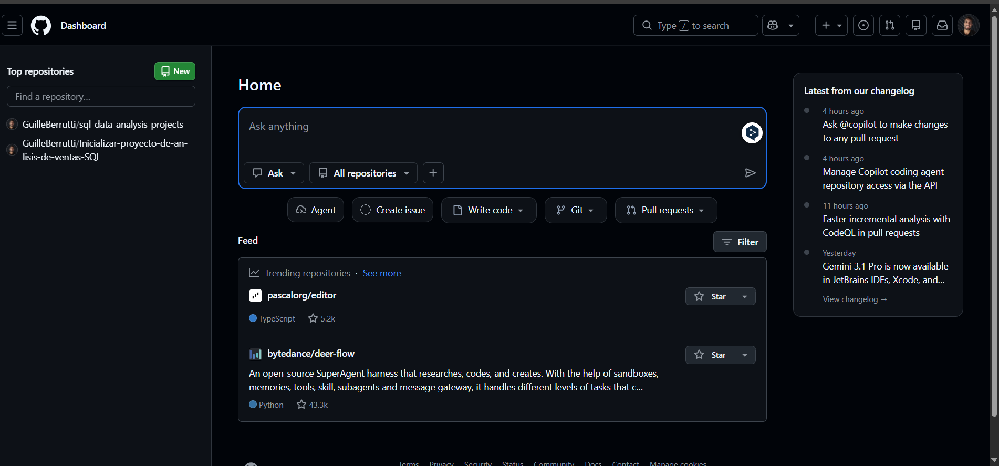

# Análisis de Datos: E-commerce Northwind

## 📊 Visualización de Dashboards (Power BI)
En esta sección se presentan los tableros interactivos diseñados para la toma de decisiones estratégicas.

  
📈 Ver Dashboards de Power BI

   

  ### Análisis de Ventas y Categorías
  

  ### Detalle de Inventario y Operaciones
  

---

## 💾 Resultados de Ejecución de Scripts (SQL)
Evidencia de la salida de datos tras ejecutar los scripts de PostgreSQL sobre la base de datos Northwind.

  
📑 Ver: Resultados de Consultas SQL

   

  ### Reporte de Rentabilidad
  Visualización de márgenes y ganancias por producto:
  

  ### Control de Stock (Semáforo)
  Resultado del script de alertas de inventario:
  

  ### Otros Resultados de Consultas
  

---

## 🛠️ Stack Técnico
* **Motor de DB:** PostgreSQL
* **Herramienta de Consulta:** DBeaver / pgAdmin
* **Visualización:** Power BI
* **Control de Versiones:** Git & GitHub
