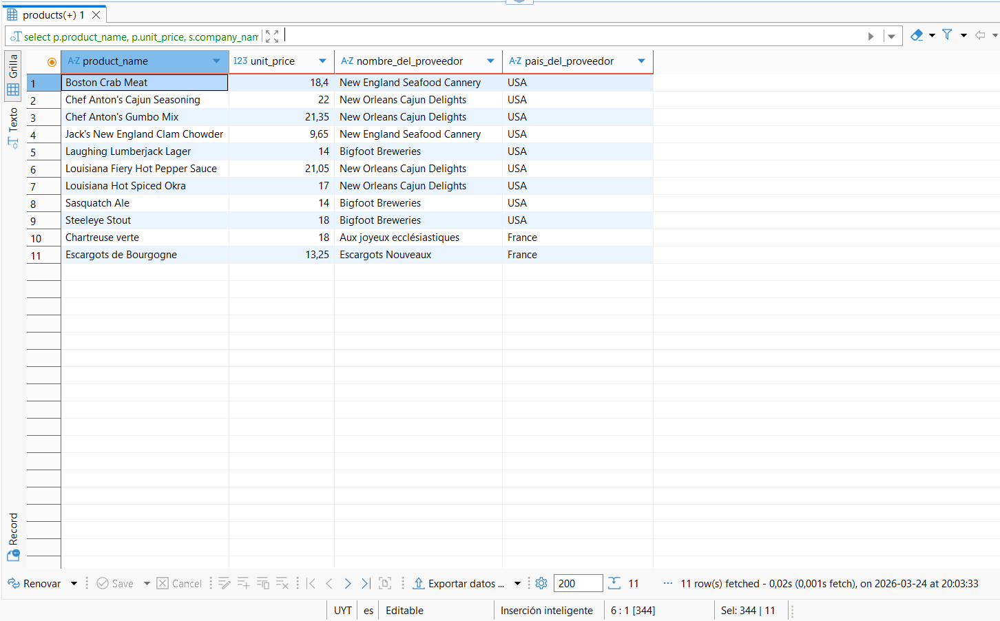
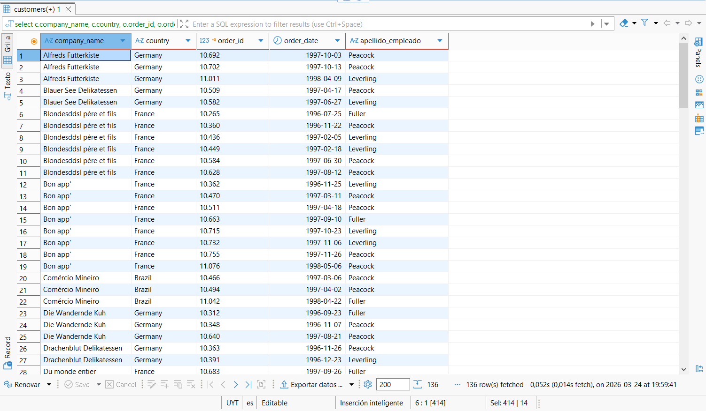
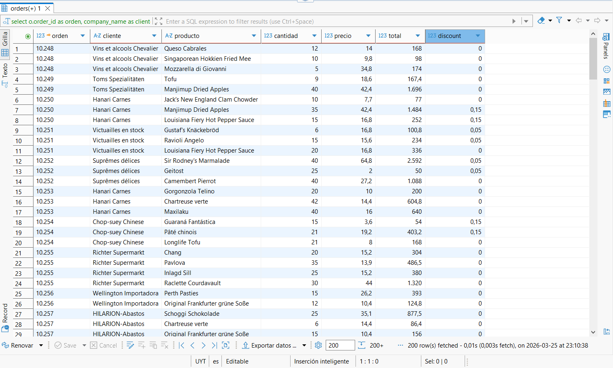
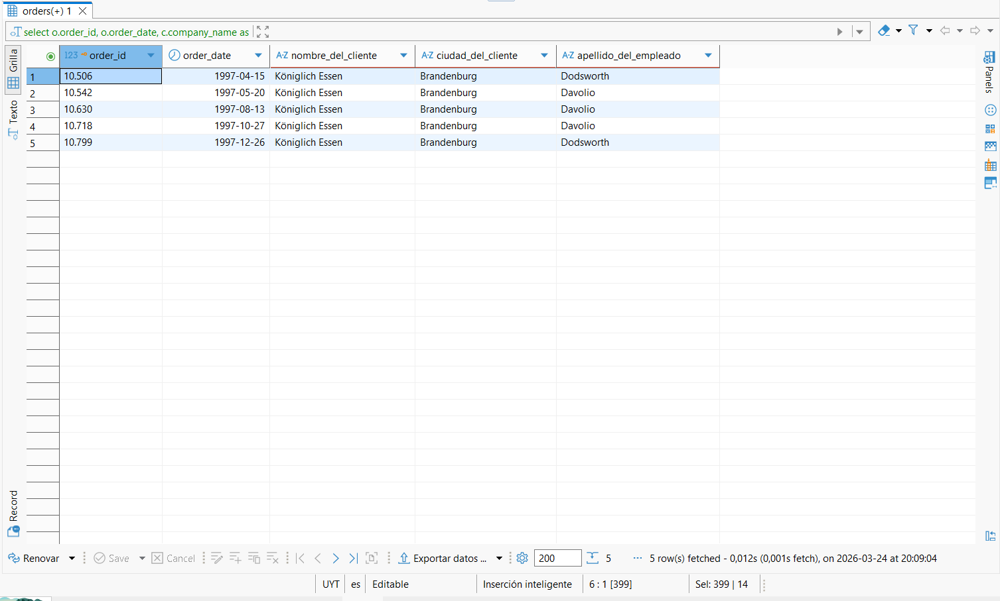

# Análisis de Datos: E-commerce Northwind

---

## 🎯 Preguntas de Negocio Resueltas
Este proyecto nace para responder interrogantes clave de la gerencia mediante el análisis de datos:
1. **Ventas:** ¿Cuál es el rendimiento por categoría y quiénes son nuestros mejores clientes?
2. **Inventario:** ¿Qué productos están en riesgo de quiebre de stock y necesitan reabastecimiento inmediato?
3. **Rentabilidad:** ¿Qué segmentos de productos generan el mayor margen neto para la compañía?

---

## 📊 Visualización de Dashboards (Power BI)
*Exploración visual de los KPIs principales.*

  
📈 Ver Dashboards Interactivos

   

  ### Análisis de Ventas y Categorías
  

  ### Detalle de Inventario y Operaciones
  

---

---

## 💾 Resultados de Ejecución de Scripts (SQL)
*Evidencia técnica de la extracción y transformación de datos en PostgreSQL.*

  
📑 Ver: Resultados de Consultas SQL 

   

  ### 1. Análisis de Rentabilidad y Márgenes
  Resultado del cálculo de beneficios por producto y categoría:
  

  ### 2. Segmentación y Cartera de Clientes
  Evidencia de la consulta para identificar comportamiento de compra:
  

  ### 3. Detalle Operativo de Órdenes
  Vista minuciosa de las transacciones procesadas:
  

  ### 4. Consolidado de Consultas Ejecutadas
  Muestra general de la lógica SQL aplicada en el editor:
  

---

## 💡 Insights y Conclusiones Estratégicas
*Basado en los hallazgos del análisis:*

* **Optimización de Stock:** Se identificó que los productos de alta rotación requieren un ajuste en los puntos de pedido para evitar un 15% de pérdida potencial en ventas por falta de inventario.
* **Foco en Rentabilidad:** Aunque la categoría *Beverages* lidera en volumen, *Confections* presenta un margen superior, sugiriendo una oportunidad de expansión en esa línea.
* **Fidelización:** El análisis detectó clientes clave con inactividad superior a 6 meses, permitiendo diseñar una estrategia de reactivación directa.
  
---

## 🛠️ Stack Técnico
* **Motor de DB:** PostgreSQL
* **Herramienta de Consulta:** DBeaver / pgAdmin
* **Visualización:** Power BI
* **Control de Versiones:** Git & GitHub
